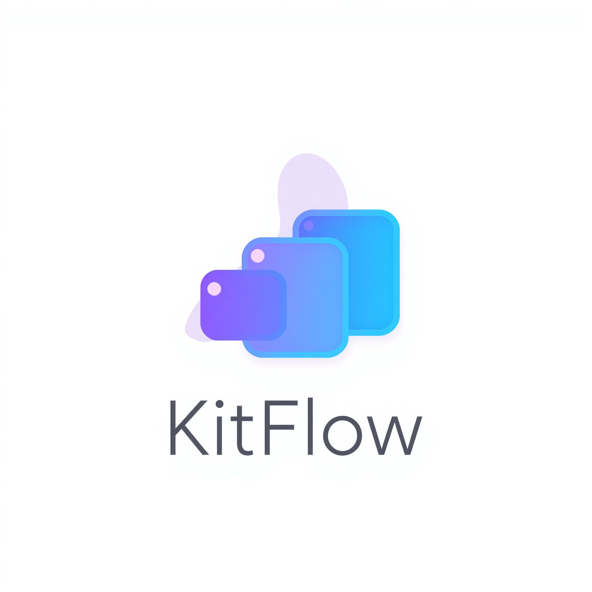

# KitFlow

<video controls playsinline width="100%" src="https://res.cloudinary.com/dgsreulhd/video/upload/v1786301010/main_ui_demo_rcjhan.mp4" title="Main UI Demo"></video>

Build truly adaptive Kotlin Multiplatform applications using a single shared UI.

KitFlow helps you create responsive layouts across Android, iOS, Desktop and Web with a simple adaptive API.


---

## Index

1. [Installation](#installation)
1. [Why KitFlow](#why-kitflow)
1. [Adaptive.value()](#adaptivevalue)
1. [Orientation Handling](#orientation-handling)
1. [Window Info](#window-info)
1. [Adaptive Layout Decisions](#adaptive-layout-decisions)
1. [AdaptiveFlowGrid](#adaptiveflowgrid)
1. [Supported Platforms](#supported-platforms)

---

## KitFlow Mark



KitFlow is built around a clean, reusable adaptive layer. The mark reflects that idea: a shared core with responsive motion and layout around it.

---

## Installation

Add Maven Central:

```kotlin
repositories {
    mavenCentral()
}
```

Add the SDK:

```kotlin
dependencies {
    implementation("io.github.vedangj72:kit-flow:1.0.4")
}
```

Use the latest version you have published.

> [!IMPORTANT]
> `Adaptive.layoutValue` and `AdaptiveFlowGrid` are source features on this branch. The latest published Maven Central version may not include them yet.

---

## Wrap Your App

Use `AdaptiveKitProvider` once near the root of your Compose app.

```kotlin
@Composable
fun App() {
    AdaptiveKitProvider {
        MainScreen()
    }
}
```

Everything inside this provider can use KitFlow APIs.

---

## Why KitFlow

KitFlow solves the problem of keeping adaptive UI logic readable, reusable, and shared across platforms.

- Shared UI without duplicating screens for every form factor
- Responsive layout decisions that stay in one place
- Adaptive components that respond to screen size and constraints
- Orientation handling for mobile and tablet experiences
- Breakpoints that stay explicit and easy to reason about
- Better developer experience for Compose Multiplatform teams

---

## Features

| Feature | What it gives you |
| --- | --- |
| `Adaptive.value()` | Responsive values for layout, spacing, typography, and more |
| `Adaptive.onOrientationChange()` | Clear portrait and landscape branching |
| Adaptive Grid | Constraint-aware grid behavior for reusable components |
| Responsive Padding | Padding that scales with screen class |
| Responsive Typography | Text sizing that stays readable across devices |
| Adaptive Navigation | Layout decisions that fit the current surface |
| Shared Compose UI | One codebase for all supported platforms |
| Android | Native Android support |
| iOS | Native iOS support |
| Desktop | JVM desktop support |
| Web | JS and Wasm support |

---

## Adaptive.value()

<video controls playsinline width="100%" src="https://res.cloudinary.com/dgsreulhd/video/upload/v1786300968/adptive_value_explination_qzdpky.mp4" title="Adaptive.value Demo"></video>

Every UI value can adapt based on screen size.

Use it for:

- Padding
- Spacing
- Typography
- Card width
- Button height
- Corner radius
- Icon sizing

```kotlin
val previewPadding = Adaptive.value(
    sm = 12.dp,
    md = 16.dp,
    lg = 20.dp,
    tab = 24.dp,
    desktop = 28.dp
)

val previewButtonHeight = Adaptive.value(
    sm = 40.dp,
    md = 44.dp,
    lg = 48.dp,
    tab = 52.dp,
    desktop = 56.dp
)

val previewCardWidth = Adaptive.value(
    sm = 220.dp,
    md = 260.dp,
    lg = 300.dp,
    tab = 360.dp,
    desktop = 420.dp
)

val previewFontScale = Adaptive.value(
    sm = 0.92f,
    md = 0.98f,
    lg = 1.00f,
    tab = 1.06f,
    desktop = 1.12f
)
```

`Adaptive.value()` is not limited to dimensions.

It can adapt

- `Dp`
- `Sp`
- `Float`
- `Boolean`
- `Int`
- `Colors`
- `Shapes`
- Any custom value

This becomes the foundation for creating responsive Compose UIs.

> [!NOTE]
> All adaptive APIs work together to produce a single responsive UI across every supported platform.
> Use them wisely instead of writing multiple screen implementations.

---

## Orientation Handling

<video controls playsinline width="100%" src="https://res.cloudinary.com/dgsreulhd/video/upload/v1786300958/orientation_android_olbjfh.mp4" title="Android Orientation Demo"></video>

<video controls playsinline width="100%" src="https://res.cloudinary.com/dgsreulhd/video/upload/v1786300967/orientation_ios_qeoiih.mp4" title="iOS Orientation Demo"></video>

Use `Adaptive.onOrientationChange(...)` when portrait and landscape should genuinely render different content.

```kotlin
Adaptive.onOrientationChange(
    portrait = {
        PortraitContent()
    },
    landscape = {
        LandscapeContent()
    }
)
```

KitFlow automatically renders the correct UI based on orientation, so the layout decision stays declarative and easy to follow.

**Important note**

For Desktop and Desktop-class layouts, KitFlow treats the layout as Landscape by default.

Orientation based adaptation is primarily intended for mobile and tablet experiences.

---

## Window Info

Read current window state with `rememberWindowInfo()`.

```kotlin
val info = rememberWindowInfo()

Text("widthDp: ${info.widthDp}")
Text("heightDp: ${info.heightDp}")
Text("screenClass: ${info.screenClass}")
Text("orientation: ${info.orientation}")
```

Important difference:

```text
screenClass = stable screen class based on shortest side
orientation = Portrait / Landscape / Square / Unknown
```

This prevents a phone from being treated like a tablet only because it rotated.

---

## Adaptive Layout Decisions

Use `Adaptive.layoutValue(...)` when a value should follow the current available width, including rotation, split screen, and window resizing.

```kotlin
val paneCount = Adaptive.layoutValue(
    sm = 1,
    md = 1,
    lg = 2,
    tab = 3,
    desktop = 4
)
```

`Adaptive.value(...)` remains shortest-side based for stable visual values; `Adaptive.layoutValue(...)` is width based for reflow decisions.

---

## AdaptiveFlowGrid

`AdaptiveFlowGrid` automatically fits equal-width columns inside its actual parent constraints. This makes reusable components respond to phones, rotation, split screen, and resizable windows without device-name checks.

```kotlin
import com.adaptive.kit_flow.layout.AdaptiveFlowGrid

AdaptiveFlowGrid(
    minColumnWidth = 160.dp,
    maxColumns = 3,
    horizontalSpacing = 12.dp,
    verticalSpacing = 12.dp
) {
    repeat(6) { index ->
        Card {
            Text("Item $index", Modifier.padding(16.dp))
        }
    }
}
```

Large system text increases the effective minimum column width by default, so the grid wraps earlier instead of squeezing text. Set `fontScaleAware = false` only when the content does not contain text.

The grid is eager and is intended for a small group of panels, cards, or controls. Continue using `LazyVerticalGrid` for long or unbounded collections.

Apply safe-area or window-inset padding outside the grid; the remaining usable width is then handled automatically. Children keep their natural height. If a parent imposes a smaller height, use scrolling, a lazy grid, or opt in to `clipOverflow = true` when clipped overflow is the intended behavior.

---

## Supported Platforms

- Android
- iOS
- Desktop
- Web

---

## Accessibility

KitFlow helps keep UI stable when font scale increases.

```kotlin
val accessibility = LocalAdaptiveAccessibilityInfo.current
```

Available values:

```kotlin
accessibility.fontScale
accessibility.fontScaleClass
accessibility.minimumTouchTarget
accessibility.reducedMotion
accessibility.highContrast
accessibility.differentiateWithoutColor
```

Use `AdaptiveAccessibleLayout` when a `Row` may break with large text.

```kotlin
AdaptiveAccessibleLayout(
    normal = {
        Row {
            Title()
            Actions()
        }
    },
    largeText = {
        Column {
            Title()
            Actions()
        }
    }
)
```

Use `adaptiveTouchTarget()` for clickable UI.

```kotlin
Modifier
    .adaptiveTouchTarget()
    .clickable { onClick() }
```

Use `adaptiveSemantics()` for clear labels and state.

```kotlin
Modifier.adaptiveSemantics(
    label = "Download file",
    role = Role.Button
)
```

Use `AdaptiveIconButton` for icon-only actions.

```kotlin
AdaptiveIconButton(
    icon = Icons.Default.Close,
    contentDescription = "Close",
    onClick = onClose
)
```

**Icon-only buttons must have meaningful labels.**

---

## Compose Layout Notes

There are certain things to keep in mind while making layouts or components in Jetpack Compose:

- Keep the layout system in mind.
- Draw the layout on paper first when the UI has multiple states.
- Consider portrait and landscape mode, along with state changes.
- Avoid fixed size, height, and width unless the element truly requires it.
- Do not hardcode height, width, or size for responsive containers.
- Prefer `aspectRatio(...)`, `weight(...)`, `fillMaxWidth()`, `widthIn(...)`, `heightIn(...)`, and constraints.
- For text, use `maxLines`, wrapping strategy, and `TextOverflow.Ellipsis` where needed.
- Use vertical scroll for simple static content that may overflow.
- Use `LazyColumn` or `LazyRow` for lists.
- Review official Compose adaptive layouts and pick the correct layout strategy.
- If KitFlow fits the case, use KitFlow to keep adaptive values consistent.

Example with official window size class style:

```kotlin
when (windowSizeClass) {
    WindowWidthSizeClass.Compact -> {
        Column {
            LeftPanel()
            RightPanel()
        }
    }

    WindowWidthSizeClass.Medium,
    WindowWidthSizeClass.Expanded -> {
        Row {
            LeftPanel(
                modifier = Modifier.weight(1f)
            )

            RightPanel(
                modifier = Modifier.weight(1f)
            )
        }
    }
}
```

With KitFlow, the same idea can be kept inside your SDK-driven layout flow:

```kotlin
val info = rememberWindowInfo()

AdaptiveFlowGrid(
    minColumnWidth = 240.dp,
    maxColumns = 2,
    horizontalSpacing = 16.dp,
    verticalSpacing = 16.dp
) {
    Card {
        LeftPanel(modifier = Modifier.padding(16.dp))
    }

    Card {
        RightPanel(modifier = Modifier.padding(16.dp))
    }
}
```

**KitFlow does not remove the need to understand Compose layout.** It helps you arrange adaptive code in one clear flow.

---

## Official Notes

Keep these official docs close while designing adaptive Compose UI:

- [Support different display sizes](https://developer.android.com/develop/adaptive-apps/guides/support-different-display-sizes)
- [Build adaptive apps](https://developer.android.com/develop/ui/compose/build-adaptive-apps)
- [Compose layout basics](https://developer.android.com/develop/ui/compose/layouts/basics)
- [Adaptive do's and don'ts](https://developer.android.com/develop/adaptive-apps/guides/adaptive-dos-and-donts)
- [Material Design 3 in Compose](https://developer.android.com/develop/ui/compose/designsystems/material3)

---

## Design Principle

**KitFlow should resolve adaptive context and adaptive values, not own the UI.**

Developers keep using normal Compose components. KitFlow helps those components adapt.

---

## Future Vision

What we expect from contributors:

1. Make it robust
1. Make it easy to use
1. Make component-based, platform-friendly layouts so importing and updating the codebase stays simple

Contributions should push KitFlow toward a clearer shared SDK experience, not toward platform-specific duplication.

---

## Notes

- `Adaptive.value()` stays shortest-side based for stable visual values.
- `Adaptive.layoutValue()` follows current width for reflow decisions.
- `AdaptiveFlowGrid` is intended for small groups of panels, cards, or controls.
- Desktop and Desktop-class layouts are treated as Landscape by default for orientation handling.
- The detailed Compose and adaptive guidelines above are meant to stay at the end of the README so the learning path remains: install, wrap, then build.
